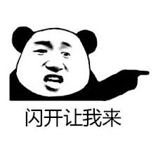

# 编码知多少

## 引子

有如下一个例子：

```js
var x = 'abcd';
var y = 'abcd​';

if (x === y) {
    console.log('That\'s right.');
} else {
    console.log('On no. There is a bug.');
}

// What it is?
```


## 计算机编码

计算机编码指电脑内部代表文字、符号、字母或数字的方式。电子计算机的文数字编码，是指在计算机硬件软件中对于文字或数值的内部表示。通常数值会储存为字节，而以组成它们的位元（bit）数给以名称。选择数值和位元模式之间的编码，可以使计算机的操作便利；计算机处理器指令集所使用的位元编码，通常需要将其格式再转换以供外界的使用者来判读，例如打印和显示。对于纸笔书写看似相同的文字符号或数值，在不同类型的电子计算机处理器内部中，可能有不同的约定用于整数和实数。大多数计算都是使用适合处理器暂存器的数码格式来执行，但是某些软件系统允许使用多种储存方式，来表示任意大数。[[1]](https://zh.wikipedia.org/wiki/%E8%AE%A1%E7%AE%97%E6%9C%BA%E7%BC%96%E7%A0%81)

| bit数 | 组合 |  |
| ---- | ---- | ---- |
| 1 | 2 | 0 1 |
| 2 | 4 | 00 01 10 11 |
| 3 | 8 | 000 001 010 011 100 101 110 111 |
| 4 | 16 |0000 0001 0010 0011 0100 0101 0110 0111 1000 1001 1010 1011 1100 1101 1110 1111 |

使用n位可以表示2^n个不同的值

## 数字

数学上 -∞ ～ +∞

计算机中数字类型（以C语言为例）

* short(16)
* int(32)
* long(32)
* float(32)
* double(64)

## 字符

对于数字可以很简单的通过进制转换为计算机的二进制表示，对于字符呢？也可以采用类似的方式进行二进制表示，但是如何转换呢？

### ASCII

上个世纪60年代，美国制定了一套字符编码，对英语字符与二进制位之间的关系，做了统一规定。这被称为 ASCII 码，一直沿用至今。[[2]](http://www.ruanyifeng.com/blog/2007/10/ascii_unicode_and_utf-8.html)

1968年版ASCII编码速见表[[3]](https://zh.wikipedia.org/wiki/ASCII)


[在线查询工具](http://ascii.911cha.com/)

ASCII使用8bit来表示，但是实际只使用到了7个bit位，共128个字符，最高位始终为0。

### ISO-8859-1/Windows-1252

慢慢欧洲的一些国家也开始使用计算机，ASCII 并不能满足他们的使用需要，于是将8bit的后一半用来编码自己国家的语言，ISO-8859-1 就诞生了。（搞过jsp的应该都知道）

Windows为了支持英语和西欧字符，自己设计了一个编码，对应的在Code Page号是1252，被称为Windows-1252。可以认为Windows-1252是ISO-8859-1的超集。

### GB2312

GB 2312 或 GB 2312–80 是中华人民共和国国家标准简体中文字符集，全称《信息交换用汉字编码字符集·基本集》，通常简称GB，又称GB0，由中国国家标准总局发布，1981年5月1日实施。GB 2312编码通行于中国大陆；新加坡等地也采用此编码。中国大陆几乎所有的中文系统和国际化的软件都支持GB 2312。

GB 2312标准共收录6763个汉字，其中一级汉字3755个，二级汉字3008个；同时收录了包括拉丁字母、希腊字母、日文平假名及片假名字母、俄语西里尔字母在内的682个字符。

GB 2312的出现，基本满足了汉字的计算机处理需要，它所收录的汉字已经覆盖中国大陆99.75%的使用频率。但对于人名、古汉语等方面出现的罕用字和繁体字，GB 2312不能处理，因此后来GBK及GB 18030汉字字符集相继出现以解决这些问题。[[4]](https://zh.wikipedia.org/wiki/GB_2312)

### Unicode

美国有美国的编码标准，欧洲有欧洲的编码标准，中国有中国的编码标准，如果每一种语言都要制定一套自己都编码，世界上的编码标准就太多了。同一个二进制数字可以被解释成不同的符号，使用错误的编码方式解码就会出现乱吗，这非常不利于信息传递。

于是武林各派就迫切希望有一位盟主出世，来一统江湖。。。



Unicode（中文：万国码、国际码、统一码、单一码）是计算机科学领域里的一项业界标准。它对世界上大部分的文字系统进行了整理、编码，使得电脑可以用更为简单的方式来呈现和处理文字。 

Unicode 伴随着通用字符集的标准而发展，同时也以书本的形式对外发表。Unicode 至今仍在不断增修，每个新版本都加入更多新的字符。当前最新的版本为2019年5月公布的12.1.0，已经收录超过13万个字符（第十万个字符在2005年获采纳）。Unicode涵盖的数据除了视觉上的字形、编码方法、标准的字符编码外，还包含了字符特性，如大小写字母。

Unicode 的实现方式不同于编码方式。一个字符的 Unicode 编码是确定的。但是在实际传输过程中，由于不同系统平台的设计不一定一致，以及出于节省空间的目的，对 Unicode 编码的实现方式有所不同。Unicode 的实现方式称为 Unicode转换格式（Unicode Transformation Format，简称为 UTF）。[[5]](https://zh.wikipedia.org/wiki/Unicode)

#### UTF-8

如果一个仅包含基本 7 位 ASCII 字符的 Unicode 文件，如果每个字符都使用 2 字节的原 Unicode 编码传输，其第一字节的 8 位始终为 0。这就造成了比较大的浪费。对于这种情况，可以使用 UTF-8 编码，这是一种变长编码，它将基本 7 位 ASCII 字符仍用 7 位编码表示，占用一个字节（首位补 0）。而遇到与其他 Unicode 字符混合的情况，将按一定算法转换，每个字符使用 1-3 个字节编码，并利用首位为 0 或 1 进行识别。这样对以7位ASCII字符为主的西文文档就大幅节省了编码长度。

互联网工程工作小组（IETF）要求所有互联网协议都必须支持UTF-8编码。互联网邮件联盟（IMC）建议所有电子邮件软件都支持UTF-8编码。[[6]](https://zh.wikipedia.org/wiki/UTF-8)


#### UTF-16

UTF-16是Unicode字符编码五层次模型的第三层：字符编码表（Character Encoding Form，也称为"storage format"）的一种实现方式。即把Unicode字符集的抽象码位映射为16位长的整数（即码元）的序列，用于数据存储或传递。Unicode字符的码位，需要1个或者2个16位长的码元来表示，因此这是一个变长表示。[[7]](https://zh.wikipedia.org/wiki/UTF-16)

对于编号小于 65536 的字符，采用固定两个字节以编号的二进制作为编码的值。对于增补字符集（编号大于 65536），首先拿本身的 Unicode 编号减去 65536 得到当前字符在增补字符集中的排列序号，接着分出两个代理项并加上特定的数值，使得他们各自位于特定的范围中，并以此来区分某个字符究竟是两个字节存储的还是四个字节存储的。

#### UTF-32

UTF-32是32位Unicode转换格式（Unicode Transformation Formats， 或UTF）的缩写。UTF-32是一种用于编码Unicode的协定，该协定使用32位比特对每个Unicode码位进行编码（但前导比特数必须为零，故仅能表示221个Unicode码位）。与其他可变长度的Unicode转换格式（UTF）相比，UTF-32编码长度是固定的，UTF-32中的每个32位值代表一个Unicode码位，并且与该码位的数值完全一致。[[8]](https://zh.wikipedia.org/wiki/UTF-32)

## JavaScript中的编码

ES6之前，JavaScript字符编码方式使用UCS-2。为什么是UCS-2？

* UCS-2是UCS组织开发的，于1990年公布
* UTF-16是Unicode组织开发的，与1996年7月公布
* js是1995年5月，Brendan Eich用了10天设计出来的

ES6使用UTF-16字符串编码，解决了字符超过两个字节时出现异常的问题。

获取字符串编码

[charCodeAt()](https://developer.mozilla.org/zh-CN/docs/Web/JavaScript/Reference/Global_Objects/String/charCodeAt) vs [codePointAt()](https://developer.mozilla.org/zh-CN/docs/Web/JavaScript/Reference/Global_Objects/String/codePointAt)

```js
var x = '大';
var y = '😂';
console.log(x, `length[${x.length}]`, x.charCodeAt(0).toString(16), x.codePointAt(0).toString(16));
console.log(y, `length[${y.length}]`, y.charCodeAt(0).toString(16), y.codePointAt(0).toString(16));
console.log(y.charCodeAt(1).toString(16), y.codePointAt(1).toString(16));
```

根据编码构建字符串

[fromCharCode()](https://developer.mozilla.org/zh-CN/docs/Web/JavaScript/Reference/Global_Objects/String/fromCharCode) vs [fromCodePoint()](https://developer.mozilla.org/zh-CN/docs/Web/JavaScript/Reference/Global_Objects/String/fromCodePoint)

```js
console.log(String.fromCharCode(0x5927), String.fromCodePoint(0x5927));
console.log(String.fromCodePoint(0xd83d, 0xde02), String.fromCodePoint(0x1f602));
```

获取正确的长度

```js
console.log(x, Array.from(x).length);
console.log(y, Array.from(y).length);
```

正则匹配

```js
console.log(/^.$/.test(x), /^.$/.test(y));
console.log(/^..$/.test(x), /^..$/.test(y));
console.log(/^.$/u.test(x), /^.$/u.test(y));
```

直接使用unicode定义字符串

```js
console.log('\ud83d\ude02' === y, '\ud83d\ude02');
console.log('\u1f602' === y, '\u1f602');
console.log('\u{1f602}' === y, '\u{1f602}');
```

遍历

```js
for (let i = 0; i < y.length; i++) {
  console.log(y[i]);
}
for (let i of y) {
  console.log(i);
}
```

序列化

```js
JSON.stringify('\u{1f602}');
JSON.stringify('\ud83d');
```

*扩展阅读*

* [字符串的扩展](http://es6.ruanyifeng.com/#docs/string)
* [ES6走走看看—字符到底发生了什么变化](https://juejin.im/post/5b913a856fb9a05d212e75bf)

