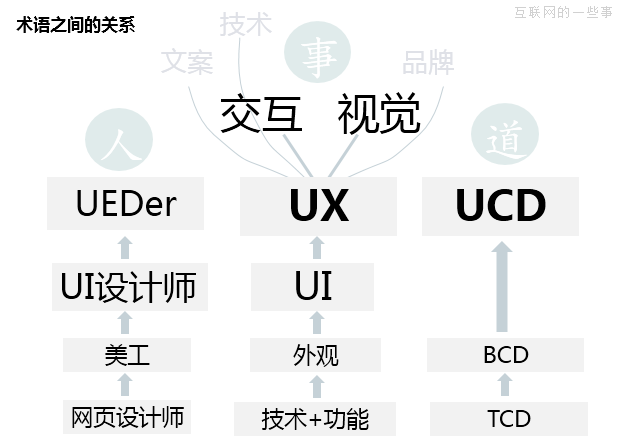
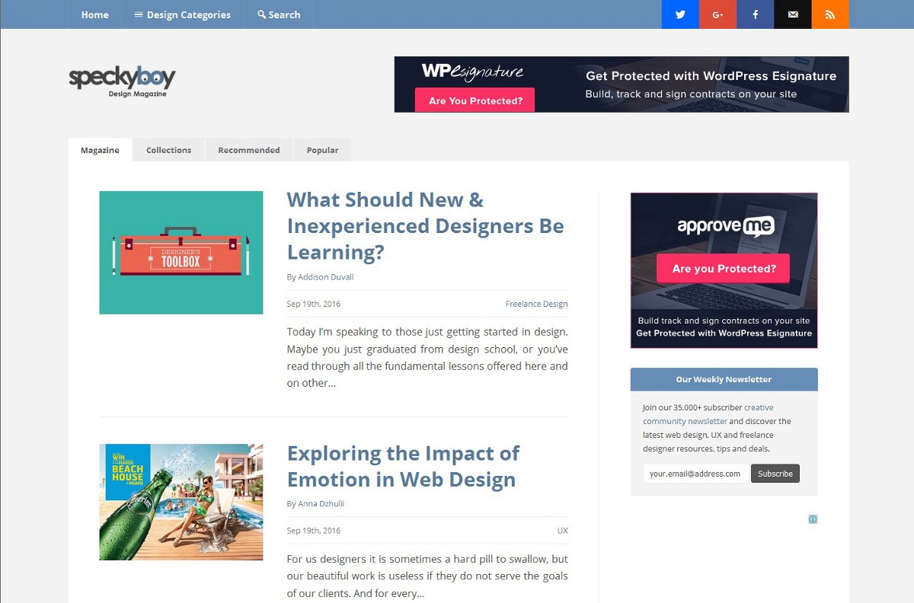
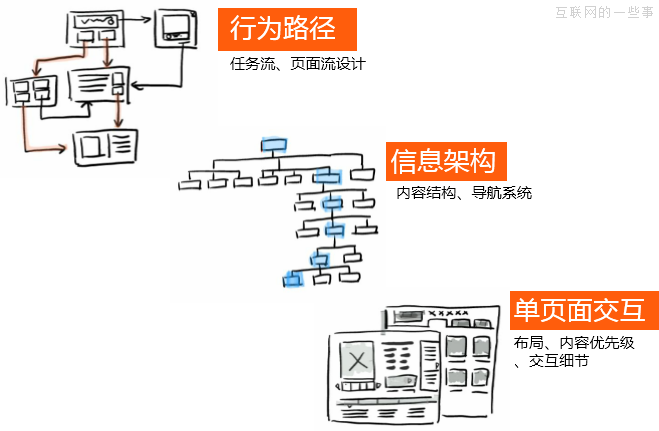
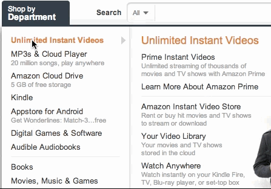
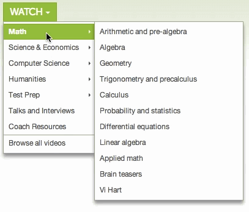
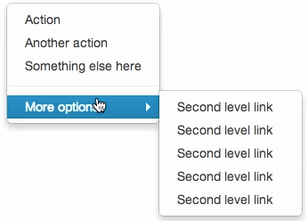
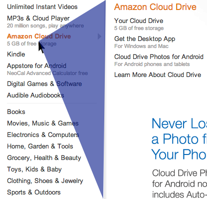
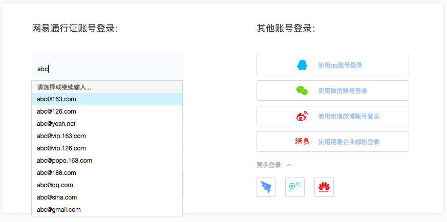
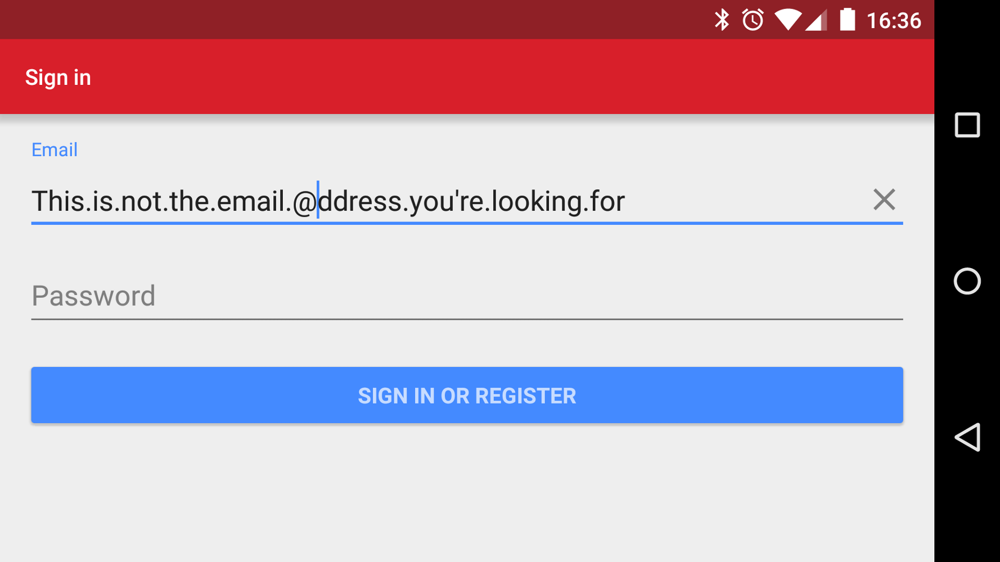
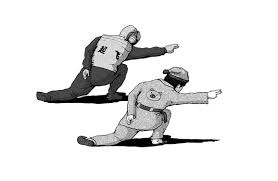

# 前端设计

### 互联网应用开发大前端的那些人和事。

### 前端开发UI设计图

### 前端开发中的UE/UX

## 优秀的设计

### Amazon下拉菜单

有兴趣可以到[Amazon](https://www.amazon.com/)亲自体验一下。再来看一下普通的设计实现。

很明显的延迟，有木有？为什么呢？可以不要延迟吗？

没有延迟的情况下，选择子菜单就有些困难。怎样才能完美解决？

鼠标光标从主菜单移向子菜单的时候，图中三角形区域会停止事件判定。

jQuery插件——[jQuery-main-aim](https://github.com/kamens/jQuery-menu-aim)

### Chrome iOS 笑脸标签

当打开标签数超过99，数字标识会变成一个笑脸。

### 网易有道登录

输入时自动下拉列出常用邮箱地址。

### 银行卡号、手机号自动分割

### 清空输入内容

### 更多优秀的设计期待你的加盟

## 糟糕的设计

[2015年全球最丑的网站排行榜新鲜出炉](http://www.uisdc.com/2015-most-ugly-websites)

### 常见的设计错误

* 错误使用颜色
* 排版混乱
* 滥用弹出窗口
* 文字难于阅读，字体太小，与背景对比不够
* 过度使用图像
* 表单或流程太复杂
* 文案拼写错误
* 缺少导航或者导航混乱

你见过的糟糕的网页设计？

## 前端设计基本原则

三个基本原则：简单、美观和规范

### 简单

* 不需要思考——界面上所有元素所提供的功能一目了然，没有歧义，易于理解。

* 不需要学习——不需要复杂的培训，所有的功能遵循操作的习惯，直接上手可以使用。

### 美观

* 重复——同样作用的元素的风格、颜色统一

* 对比——不同作用的元素，要有鲜明的对比，可以使用字体、颜色等等方面来达到对比的效果。

* 对齐——灵活使用左对齐、右对齐、居中对齐等对齐方式，让元素的排列显得整齐、规矩。

* 亲密性——有关联的元素要尽可能“亲密”地排列，而无关联的元素之间要有足够的“距离”来产生美。

### 规范

主要面向程序设计，前端工程师的舞台。

## 扩展阅读

[Web设计的设计原则有哪些？](https://www.zhihu.com/question/32231162)

[如何从网页设计转型为用户体验设计](http://uxren.cn/?p=40770)

[如何成为一名更加贴心的用户体验设计师](https://36kr.com/p/218194.html)

[史上最完整交互设计基本原则](https://36kr.com/p/5042087.html)