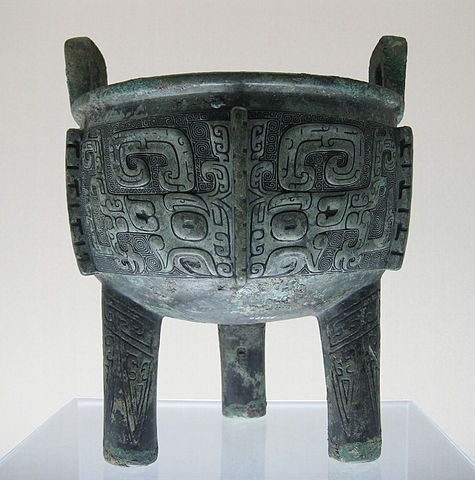

# 西天取经之前端演化

## 前端？What？

除了这些，还有吗？

* 浏览器兼容性
* 移动端适配（响应式、原生交互）
* 性能
* 安全
* 。。。

Oh my god! 这简直就是东北大乱炖嘛！

于是，有人总结了下面的前端烧脑图--

图片来源及更多内容可进一步[阅读](https://leohxj.gitbooks.io/front-end-database/interview/skill-path.html)

## 起源

1989年3月，伯纳斯.李撰写了《关于信息化管理的建议》一文，文中提及ENQUIRE并且描述了一个更加精巧的管理模型[7]。1990年11月12日他和罗伯特·卡里奥合作提出了一个更加正式的关于万维网的建议[8]。在1990年11月13日他在一台NeXT工作站上写了第一个网页以实现他文中的想法[9]。

在那年的圣诞节，伯纳斯-李制作了要让网络工作的所有必要工具[10]：第一个网页浏览器WorldWideWeb（同时也是网页编辑器）和第一个网页服务器。

1991年8月6日，他在alt.hypertext新闻组上贴了万维网项目简介的文章[11]。这一天也标志着因特网上万维网公共服务的首次亮相。

## 远古时代

* 1992年5月: Pei Wei的 “Viola” GUI 浏览器X测试版本诞生。
* 1993年2月: 国家超级计算应用中心（National Center for Supercomputing Applications ）发布了编写的“Mosaic for X” 的第一份alpha版本。
* 1993年4月: 欧洲核子研究中心宣布万维网技术将可以被人们免费使用，欧洲核子研究中心将不收取和此项技术相关的费用。
* 1994年5月: 第一节国际万维网大会在日内瓦的欧洲核子研究中心召开。
* 1994年10月: 万维网联盟（World Wide Web Consortium ，即W3C）成立。

## 石器时代

1994年12月，Netscape公司发布了Navigator 1.0版，市场份额一举超过90%。

HTML规范虽然规定了网页中的标题、段落应该使用的标签，但是没有涉及这些内容应该以何种样式(比如大小、位置、间距、缩进等属性)呈现在浏览器中。从1990年代初HTML被发明开始，样式表就以各种形式出现了。不同的浏览器结合了它们各自的样式语言，读者(也就是浏览网页的用户)可以使用这些样式语言来调节网页的显示方式。一开始样式表是给读者用的，最初的HTML版本只含有很少的显示属性，读者来决定网页应该怎样被显示。

1994年，哈肯·维姆·莱和伯特·波斯合作设计CSS。他们在1994年首次在芝加哥的一次会议上第一次展示了CSS的建议。

扩展阅读[全球共庆万维网诞生25周年](https://www.w3.org/webat25/news/press-release-launch-zh)

## 青铜器时代（浏览器大战）

Netscape 公司很快发现，Navigator浏览器需要一种可以嵌入网页的脚本语言，用来控制浏览器行为，例如浏览器端验证用户输入信息。

管理层对这种浏览器脚本语言的设想是：功能不需要太强，语法较为简单，容易学习和部署。那一年，正逢Sun公司的Java语言问世，市场推广活动非常成功。Netscape公司决定与Sun公司合作，浏览器支持嵌入Java小程序（后来称为Java applet）。但是，浏览器脚本语言是否就选用Java，则存在争论。后来，还是决定不使用Java，因为网页小程序不需要Java这么“重”的语法。但是，同时也决定脚本语言的语法要接近Java，并且可以支持Java程序。这些设想直接排除了使用现存语言，比如Perl、Python和TCL。

1995年，Netscape公司雇佣了程序员Brendan Eich开发这种网页脚本语言。Brendan Eich有很强的函数式编程背景，希望以Scheme语言（函数式语言鼻祖LISP语言的一种方言）为蓝本，实现这种新语言。

1995年5月，Brendan Eich只用了10天，就设计完成了这种语言的第一版。它是一个大杂烩，语法有多个来源：

* 基本语法：借鉴C语言和Java语言。
* 数据结构：借鉴Java语言，包括将值分成原始值和对象两大类。
* 函数的用法：借鉴Scheme语言和Awk语言，将函数当作第一等公民，并引入闭包。
* 原型继承模型：借鉴Self语言（Smalltalk的一种变种）。
* 正则表达式：借鉴Perl语言。
* 字符串和数组处理：借鉴Python语言。

与此同时，微软在获取Mosaic的授权后，推出了Internet Explorer 1，于8月起透过“Windows 95 Plus!”搭售。三个月后，Internet Explorer 2推出，与网景直接的激烈竞争就此开始。

1995年12月4日，Netscape 公司与 Sun 公司联合发布了 JavaScript 语言。当时的意图是将 JavaScript 作为 Java 的补充，用来操作网页。

1996年3月，Navigator 2.0 浏览器正式内置了 JavaScript 脚本语言。

同年，微软推出Internet Explorer 3，并模仿JavaScript开发了一种相近的语言，取名为JScript（JavaScript是Netscape的注册商标），同时支持CSS，使市场占有率开始紧追Netscape。

1996年11月，Netscape公司决定将JavaScript提交给国际标准化组织ECMA（European Computer Manufacturers Association），希望JavaScript能够成为国际标准，以此抵抗微软。

1997年10月，Internet Explorer 4版正式推出，并在旧金山举行产品发表会，而引人注目的地方便是竖立了一个10呎长的巨型"e"标志。第二天早上，Netscape的员工们在前方的草坪上发现了巨型标志，上面写着“From the IE team ... We Love You”。Netscape员工立刻把巨型标志推翻，并放上其吉祥物Mozilla恐龙，恐龙手上纸牌写着“Netscape 72, Microsoft 18”，代表当时的浏览器市场占有率。

但随着Internet Explorer 4的推出，对这场浏览器大战产生了重大改变，它在匹配W3C制定的网页标准方面，做得比Netscape Navigator 4.0要好，同时也能加载动态网页，其文字或图像的位置可以改变。

经过微软一系列手段打击及Netscape自身一些原因，其于1998年年底，彻底被IE击败。其后以42亿美元被美国在线（AOL）收购。

1996年12月发表了CSS1：

* 支持字体的大小、字形、强调
* 支持字的颜色、背景的颜色和其他元素
* 支持文章特征如字母、词和行之间的距离
* 支持文字的排列、图像、表格和其他元素
* 支持边缘、围框和其他关于排版的元素
* 支持id和class

1997年7月，ECMA组织发布262号标准文件（ECMA-262）的第一版，规定了浏览器脚本语言的标准，并将这种语言称为ECMAScript。这个版本就是ECMAScript 1.0版。之所以不叫JavaScript，一方面是由于商标的关系，Java是Sun公司的商标，根据一份授权协议，只有Netscape公司可以合法地使用JavaScript这个名字，且JavaScript已经被Netscape公司注册为商标，另一方面也是想体现这门语言的制定者是ECMA，不是Netscape，这样有利于保证这门语言的开放性和中立性。

1998年5月W3C发表了CSS2：

* 绝对的、相对的和固定的定比特素、媒体型的概念
* 双向文件和
* 一个新的字体
* 修改了CSS2中的一些错误，删除了其中基本不被支持的内容和增加了一些已有的浏览器的扩展内容。

## 铁器时代

1998年，Netscape以开放源代码的授权形式，把Communicator源代码发布，该新产品仍然使用Mozilla的名称，透过把程序彻底重新编写，Mozilla已在多方面得到改进。

1999年，IE 5部署了XMLHttpRequest接口，允许JavaScript发出HTTP请求，为后来大行其道的Ajax应用创造了条件。

2000年，KDE项目重写了浏览器引擎KHTML，为后来的WebKit和Blink引擎打下基础。这一年的10月23日，KDE 2.0发布，第一次将KHTML浏览器包括其中

2001年，微软发布了IE浏览器的下一个版本Internet Explorer 6。这是当时最先进的浏览器，它后来统治了浏览器市场多年。

同年，Douglas Crockford提出了JSON格式，用于取代XML格式，进行服务器和网页之间的数据交换。JavaScript可以原生支持这种格式，不需要额外部署代码。

## 蒸汽时代

2002年，Mozilla推出1.0版，并迅即在开源社群中得以普及。同时又出现多款派生产品，包括轻量跨平台浏览器，名为Firefox，它于2004年推出1.0版。

2003年，苹果公司发布了Safari浏览器的第一版。

2004年4月，Google公司发布了Gmail，促成了互联网应用程序（Web Application）这个概念的诞生。

同年6月，WHATWG组织成立，致力于加速HTML语言的标准化进程。

同年9月，Dojo框架诞生，为不同浏览器提供了同一接口，并为主要功能提供了便利的调用方法。这标志着JavaScript编程框架的时代开始来临。

2005年6月，苹果公司在KHTML引擎基础上开发WebKit引擎开源。

同年12月，SVG的支持被加入到了WebKit引擎标准版本。

## 电气时代

2005年，Ajax（Asynchronous JavaScript and XML）由Jesse James Garrett发明。它开始流行的标志是，2月份发布的Google Maps项目大量采用该方法。它几乎成了新一代网站的标准做法，促成了Web 2.0时代的来临。

2006年1月，John Resig发布了jQuery 1.0。全球前10,000个访问最高的网站中，有65%使用了jQuery，是目前最受欢迎的JavaScript库。

## 信息时代
