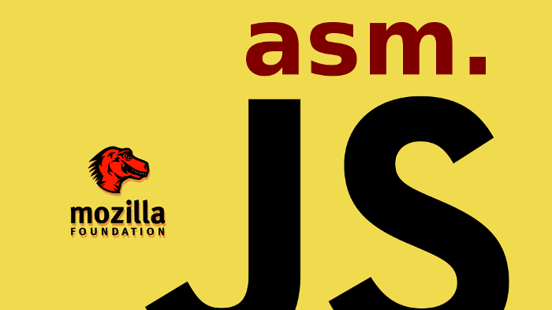

# 西天取经之前端演化

## 前端？What？

除了这些，还有吗？

* 浏览器兼容性
* 移动端适配（响应式、原生交互）
* 性能
* 安全
* 。。。

Oh my god! 这简直就是东北大乱炖嘛！

于是，有人总结了下面的前端烧脑图--

图片来源及更多内容可进一步[阅读](https://leohxj.gitbooks.io/front-end-database/interview/skill-path.html)

## 起源

1989年的圣诞节，伯纳斯-李制作了第一个网页浏览器WorldWideWeb（同时也是网页编辑器）和第一个网页服务器。

1991年8月6日，他在alt.hypertext新闻组上贴了万维网项目简介的文章。这一天也标志着因特网上万维网公共服务的首次亮相。

## 远古时代

* 1992年5月: Pei Wei的 “Viola” GUI 浏览器X测试版本诞生。

* 1993年2月: 国家超级计算应用中心（National Center for Supercomputing Applications ）发布了编写的“Mosaic for X” 的第一份alpha版本。

* 1993年4月: 欧洲核子研究中心宣布万维网技术将可以被人们免费使用，欧洲核子研究中心将不收取和此项技术相关的费用。
* 1994年5月: 第一节国际万维网大会在日内瓦的欧洲核子研究中心召开。
* 1994年10月: 万维网联盟（World Wide Web Consortium ，即W3C）成立。

扩展阅读[全球共庆万维网诞生25周年](https://www.w3.org/webat25/news/press-release-launch-zh)

## 石器时代

1994年12月，Netscape公司发布了Navigator 1.0版，市场份额一举超过90%。

HTML规范虽然规定了网页中的标题、段落应该使用的标签，但是没有涉及这些内容应该以何种样式(比如大小、位置、间距、缩进等属性)呈现在浏览器中。从1990年代初HTML被发明开始，样式表就以各种形式出现了。不同的浏览器结合了它们各自的样式语言，读者(也就是浏览网页的用户)可以使用这些样式语言来调节网页的显示方式。一开始样式表是给读者用的，最初的HTML版本只含有很少的显示属性，读者来决定网页应该怎样被显示。

1994年，哈肯·维姆·莱和伯特·波斯合作设计CSS。他们在1994年首次在芝加哥的一次会议上第一次展示了CSS的建议。

## 青铜器时代（浏览器大战）

Netscape 公司很快发现，Navigator浏览器需要一种可以嵌入网页的脚本语言，用来控制浏览器行为，例如浏览器端验证用户输入信息。

管理层对这种浏览器脚本语言的设想是：功能不需要太强，语法较为简单，容易学习和部署。那一年，正逢Sun公司的Java语言问世，市场推广活动非常成功。Netscape公司决定与Sun公司合作，浏览器支持嵌入Java小程序（后来称为Java applet）。但是，浏览器脚本语言是否就选用Java，则存在争论。后来，还是决定不使用Java，因为网页小程序不需要Java这么“重”的语法。但是，同时也决定脚本语言的语法要接近Java，并且可以支持Java程序。这些设想直接排除了使用现存语言，比如Perl、Python和TCL。

1995年，Netscape公司雇佣了程序员Brendan Eich开发这种网页脚本语言。Brendan Eich有很强的函数式编程背景，希望以Scheme语言（函数式语言鼻祖LISP语言的一种方言）为蓝本，实现这种新语言。

1995年5月，Brendan Eich只用了10天，就设计完成了这种语言的第一版。它是一个大杂烩，语法有多个来源：

* 基本语法：借鉴C语言和Java语言。
* 数据结构：借鉴Java语言，包括将值分成原始值和对象两大类。
* 函数的用法：借鉴Scheme语言和Awk语言，将函数当作第一等公民，并引入闭包。
* 原型继承模型：借鉴Self语言（Smalltalk的一种变种）。
* 正则表达式：借鉴Perl语言。
* 字符串和数组处理：借鉴Python语言。

1995年12月4日，Netscape 公司与 Sun 公司联合发布了 JavaScript 语言。当时的意图是将 JavaScript 作为 Java 的补充，用来操作网页。

与此同时，微软在获取Mosaic的授权后，推出了Internet Explorer 1，于8月起透过“Windows 95 Plus!”搭售。三个月后，Internet Explorer 2推出，与网景之间的激烈竞争就此开始。

1996年3月，Navigator 2.0 浏览器正式内置了 JavaScript 脚本语言。

同年，微软推出Internet Explorer 3，并模仿JavaScript开发了一种相近的语言，取名为JScript（JavaScript是Netscape的注册商标），同时支持CSS，使市场占有率开始紧追Netscape。

1996年11月，Netscape公司决定将JavaScript提交给国际标准化组织ECMA（European Computer Manufacturers Association），希望JavaScript能够成为国际标准，以此抵抗微软。

1997年10月，Internet Explorer 4版正式推出，并在旧金山举行产品发表会，而引人注目的地方便是竖立了一个10呎长的巨型"e"标志。第二天早上，Netscape的员工们在前方的草坪上发现了巨型标志，上面写着“From the IE team ... We Love You”。Netscape员工立刻把巨型标志推翻，并放上其吉祥物Mozilla恐龙，恐龙手上纸牌写着“Netscape 72, Microsoft 18”，代表当时的浏览器市场占有率。

但随着Internet Explorer 4的推出，对这场浏览器大战产生了重大改变，它在匹配W3C制定的网页标准方面，做得比Netscape Navigator 4.0要好，同时也能加载动态网页，其文字或图像的位置可以改变。

经过微软一系列手段打击及Netscape自身一些原因，其于1998年年底，彻底被IE击败。其后以42亿美元被美国在线（AOL）收购。

关于浏览器大战的[更多内容](https://zh.wikipedia.org/wiki/%E6%B5%8F%E8%A7%88%E5%99%A8%E5%A4%A7%E6%88%98)

1996年12月发表了CSS1：

* 支持字体的大小、字形、强调
* 支持字的颜色、背景的颜色和其他元素
* 支持文章特征如字母、词和行之间的距离
* 支持文字的排列、图像、表格和其他元素
* 支持边缘、围框和其他关于排版的元素
* 支持id和class

1997年7月，ECMA组织发布262号标准文件（ECMA-262）的第一版，规定了浏览器脚本语言的标准，并将这种语言称为ECMAScript。这个版本就是ECMAScript 1.0版。之所以不叫JavaScript，一方面是由于商标的关系，Java是Sun公司的商标，根据一份授权协议，只有Netscape公司可以合法地使用JavaScript这个名字，且JavaScript已经被Netscape公司注册为商标，另一方面也是想体现这门语言的制定者是ECMA，不是Netscape，这样有利于保证这门语言的开放性和中立性。

1998年5月W3C发表了CSS2：

* 绝对的、相对的和固定的定比特素、媒体型的概念
* 双向文件和
* 一个新的字体
* 修改了CSS2中的一些错误，删除了其中基本不被支持的内容和增加了一些已有的浏览器的扩展内容。

## 铁器时代

1998年，Netscape以开放源代码的授权形式，把Communicator源代码发布，该新产品仍然使用Mozilla的名称，透过把程序彻底重新编写，Mozilla已在多方面得到改进。

1999年，IE 5部署了XMLHttpRequest接口，允许JavaScript发出HTTP请求，为后来大行其道的Ajax应用创造了条件。

2000年，KDE项目重写了浏览器引擎KHTML，为后来的WebKit和Blink引擎打下基础。这一年的10月23日，KDE 2.0发布，第一次将KHTML浏览器包括其中

2001年，微软发布了IE浏览器的下一个版本Internet Explorer 6。这是当时最先进的浏览器，也是系列中产品生命周期最长的一个版本。市场占有率2002年时到达了80%以上，2003年时更是到达了95%。

同年，Douglas Crockford提出了JSON格式，用于取代XML格式，进行服务器和网页之间的数据交换。JavaScript可以原生支持这种格式，不需要额外部署代码。

## 蒸汽时代

2002年，Mozilla推出1.0版，并迅即在开源社群中得以普及。同时又出现多款派生产品，包括轻量跨平台浏览器，名为Firefox，它于2004年推出1.0版。

2003年，苹果公司发布了Safari浏览器的第一版。

2004年4月，Google公司发布了Gmail，促成了互联网应用程序（Web Application）这个概念的诞生。

同年6月，WHATWG组织成立，致力于加速HTML语言的标准化进程。

同年9月，Dojo框架诞生，为不同浏览器提供了同一接口，并为主要功能提供了便利的调用方法。这标志着JavaScript编程框架的时代开始来临。

> Dojo Toolkit (stylized as dōjō toolkit) is an open source modular JavaScript library (or more specifically JavaScript toolkit) designed to ease the rapid development of cross-platform, JavaScript/Ajax-based applications and web sites. It was started by Alex Russell, Dylan Schiemann, David Schontzler, and others in 2004[1] and is dual-licensed under the modified BSD license or the Academic Free License (≥ 2.1).

> The Dojo Foundation was a non-profit organization created with the goal to promote the adoption of the toolkit. In 2016, the foundation merged with jQuery Foundation to become JS Foundation.

[https://dojo.io/](https://dojo.io/)

2005年6月，苹果公司在KHTML引擎基础上开发WebKit引擎开源。

同年12月，SVG的支持被加入到了WebKit引擎标准版本。

## 电气时代

2005年，Ajax（Asynchronous JavaScript and XML）由Jesse James Garrett发明。它开始流行的标志是，2月份发布的Google Maps项目大量采用该方法。它几乎成了新一代网站的标准做法，促成了Web 2.0时代的来临。

这一年，Opera 8.5正式发布，Opera成为免费软件。早期版本使用Presto布局引擎，并可在FreeBSD系统上运行，获得13个不同的奖项。这次发布后广告被完全删除，浏览器的主要财务支持来自Google的收入（这是Opera的默认搜索引擎合同）。

Opera最早在1994年的时候，是挪威最大的电信公司Telenor的研究项目。之后作为商业浏览器，需要付费使用。直到2000年发布5.0版本，加入了Google广告，未付费用户也可以使用，但是包含广告。

2006年1月，John Resig发布了jQuery 1.0。全球前10,000个访问最高的网站中，有65%使用了jQuery，是目前最受欢迎的JavaScript库。

2006年8月，Firefox、Opera等浏览器的市场占有率持续增长，但增速放缓。据最新的调查显示，Firefox在北美，欧洲等地区的占有率已经接近或者超过20%。这使微软感受到的竞争压力倍增，促使微软加快IE7的开发步伐。月底，微软推出IE7的第一个候选版本，可以说IE7功能特性方面已经基本定型（IE7提供了标签页式浏览，RSS阅读，增强的插件控制，CSS等网页标准的增强支持，以及提供类似于Firefox扩展模式的附加插件以增加IE7的附加功能，在安全性等方面亦有较大改进）。

2007年，Douglas Crockford发表了名为《JavaScript: The good parts》的演讲，次年由O’Reilly出版社出版。这标志着软件行业开始严肃对待JavaScript语言，对它的语法开始重新认识，

2008年，V8编译器诞生。这是Google公司为Chrome浏览器而开发的，它的特点是让JavaScript的运行变得非常快。它提高了JavaScript的性能，推动了语法的改进和标准化，改变外界对JavaScript的不佳印象。同时，V8是开源的，任何人想要一种快速的嵌入式脚本语言，都可以采用V8，这拓展了JavaScript的应用领域。

同时，Google Chrome 1.0正式版发布。

2009年，Node.js项目诞生，创始人为Ryan Dahl，它标志着JavaScript可以用于服务器端编程，从此网站的前端和后端可以使用同一种语言开发。并且，Node.js可以承受很大的并发流量，使得开发某些互联网大规模的实时应用变得容易。

阅读关于Node.js的[更多内容](https://zh.wikipedia.org/wiki/Node.js)
[node.js v0.0.1 docs](https://nodejs.org/docs/v0.0.1/)

## 信息时代

2010年，得益于node及npm的发展，JavaScript进入模块化开发的时代。

* [BackboneJS](http://backbonejs.org/)
* [RequireJS](https://requirejs.org)
* [Sea.js](https://seajs.github.io/seajs/docs/)

2012年，单页面应用程序框架（single-page app framework）开始崛起，[AngularJS](https://angularjs.org/)项目和[Ember](https://www.emberjs.com/)项目都发布了1.0版本。

[AngularJS Meetup - May 2012](https://blog.angularjs.org/2012/05/angularjs-meetup-may-2012.html)

2012年，微软发布[TypeScript](https://www.typescriptlang.org/)语言。

2012年，Mozilla基金会提出[asm.js](http://asmjs.org/)规格。asm.js是JavaScript的一个子集，所有符合asm.js的程序都可以在浏览器中运行，它的特殊之处在于语法有严格限定，可以被快速编译成性能良好的机器码。这样做的目的，是为了给其他语言提供一个编译规范，使其可以被编译成高效的JavaScript代码。

2013年，ECMA正式推出JSON的国际标准，这意味着JSON格式已经变得与XML格式一样重要和正式了。

2013年5月，Facebook发布UI框架库[React](https://reactjs.org/)，引入了新的JSX语法，使得UI层可以用组件开发。

2014年2月，尤雨溪发布了[Vue.js](https://cn.vuejs.org/index.html)，并且很快成为Github上最受欢迎的开源项目之一。

2015年3月，Facebook公司发布了[React Native](https://facebook.github.io/react-native/)项目，将React框架移植到了手机端，可以用来开发手机App。它会将JavaScript代码转为iOS平台的Objective-C代码，或者Android平台的Java代码，从而为JavaScript语言开发高性能的原生App打开了一条道路。

2015年4月，[Angular](https://angular.io/)框架宣布，2.0版将基于微软公司的TypeScript语言开发，这等于为JavaScript语言引入了强类型。

2015年5月，Google公司的[Polymer](https://www.polymer-project.org/)框架发布1.0版。

2015年6月，ECMA标准化组织正式批准了ECMAScript 6语言标准，定名为《[ECMAScript 2015](https://www.ecma-international.org/ecma-262/6.0/) 标准》。

2015年6月，Mozilla 在 asm.js 的基础上发布 [WebAssembly](https://webassembly.org/) 项目。这是一种JavaScript语言编译后的二进制格式，类似于Java的字节码，有利于移动设备加载JavaScript脚本，解析速度提高了20+倍。这意味着将来的软件，会发布JavaScript二进制包。

2016年6月，《ECMAScript 2016 标准》发布。与前一年发布的版本相比，它只增加了Array.prototype.includes和指数运算符两个新特性。

2017年6月，《ECMAScript 2017 标准》发布，引入了一些新特性，其中的 async 函数值得关注，使得异步操作的写法出现了根本的变化。

2017年11月，所有主流浏览器全部支持 WebAssembly，这意味着任何语言都可以编译成 JavaScript，在浏览器运行。

随着前端项目日益复杂，自动化构建工具也应运而生。

* [Bower](https://bower.io/)
* [Gulp](https://gulpjs.com/)
* [Grunt](https://gruntjs.com/)
* [webpack](https://webpack.js.org/)

