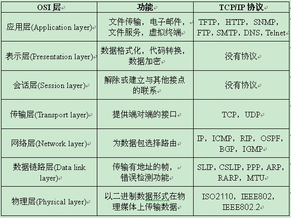
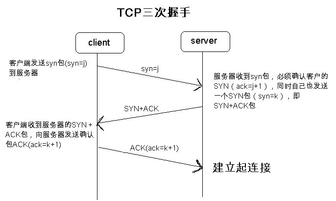
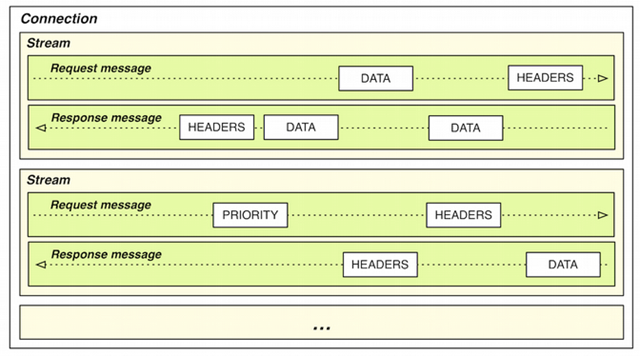
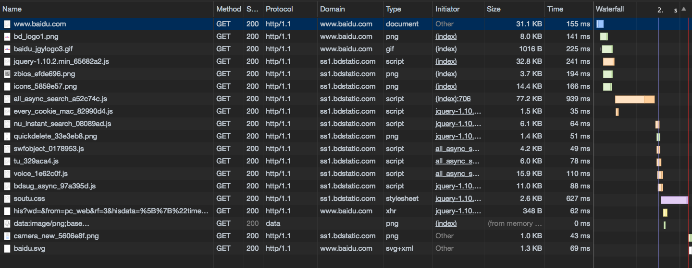
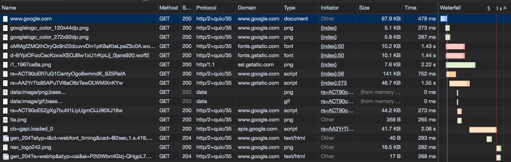

# HTTP1 vs HTTP2

## HTTP协议
HTTP协议是 Hyper Text Transfer Protocol (超文本传输协议) 的缩写，是用于从服务器传输超文本到本地浏览器的传输协议。

HTTP是一个基于TCP/IP通信协议。

### TCP/IP
Transmission Control Protocol/Internet Protocol，传输控制协议/因特网互联协议。

OSI七层与TCP/IP五层网络架构

*OSI: Open System Interconnection 开放式系统互联*

扩展阅读：[OSI七层与TCP/IP五层网络架构详解](http://network.51cto.com/art/201310/413853.htm)

### TCP三次握手

*SYN: synchronize 请求同步*

*ACK: acknowledgement 确认同步*

## HTTP/1.0
由万维网协会 (World Wide Web Consortium) 和互联网工程工作小组 (Internet Engineering Task Force) 共同合作研究

RFC 1945定义了HTTP/1.0，May 1996

为了提高系统的效率，HTTP 1.0默认使用非持久连接，浏览器与服务器每次通信都新建立一个TCP连接，服务器完成请求处理后立即断开这个TCP连接。

如需使用长连接，需在请求头加入 Connection: keep-alive

[https://www.w3.org/Protocols/HTTP/1.0/spec.html](https://www.w3.org/Protocols/HTTP/1.0/spec.html)

### Method
* GET 向特定的资源发出请求。
* POST 向指定资源提交数据进行处理请求。数据被包含在请求体中。
* HEAD 向服务器索要与GET请求相一致的响应，只不过响应体将不会被返回。

## HTTP/1.1
RFC 2616定义了HTTP/1.1，June 1999

* 默认使用持久连接，在一个TCP连接上可以传送多个HTTP请求和响应，减少了建立和关闭连接的消耗和延迟。一个包含有许多图像的网页文件的多个请求和应答可以在一个连接中传输。

* 增加 Host 字段，WEB浏览器可以使用主机头名来明确表示要访问服务器上的哪个WEB站点，这才实现了在一台WEB服务器上可以在同一个IP地址和端口号上使用不同的主机名来创建多个虚拟WEB站点。

* 新增 RANGE:bytes 字段，HTTP/1.0每次传送文件都是从文件头开始，即0字节处开始。RANGE:bytes=XXXX 表示要求服务器从文件XXXX字节处开始传送，这就是我们平时所说的断点续传！

### 新增Method
* PUT 向指定资源位置上传其最新内容。
* DELETE 请求服务器删除Request-URI所标识的资源。
* OPTIONS 返回服务器针对特定资源所支持的HTTP请求方法。也可以利用向Web服务器发送'*'的请求来测试服务器的功能性。 
* TRACE 回显服务器收到的请求，主要用于测试或诊断。 
* CONNECT 预留给能够将连接改为管道方式的代理服务器。

### 状态码
* 1xx：指示信息--表示请求已接收，继续处理
* 2xx：成功--表示请求已被成功接收、理解、接受
* 3xx：重定向--要完成请求必须进行更进一步的操作
* 4xx：客户端错误--请求有语法错误或请求无法实现
* 5xx：服务器端错误--服务器未能实现合法的请求

[https://tools.ietf.org/html/rfc2616](https://tools.ietf.org/html/rfc2616)

## HTTP/2
Hypertext Transfer Protocol Version 2 (HTTP/2), MAY 2015

HTTP/2 是一个二进制协议，区别于 HTTP/1.x 基于文本的协议。

### 三个概念
* Stream 处于一个连接中的双向二进制数据流，可以包含一个或者多个 Message。
* Message 一个完整的请求或者响应，包含多个 Frame 序列。
* Frame HTTP/2 通讯中的最小传输单位，至少含有一个 Frame header，能够表示它属于哪一个 Stream。

HTTP/2 是源于Google的SPDY协议制定完成的，当时SPDY已经充分证实了它是一个非常好用的方案。

HTTP/2 支持RFC7230中指明的HTPP/1.1的所有语义。这使得可以在不改变任何代码的情况下，仅仅通过升级客户端和服务器端的基础结构来获得HTTP/2的优点。

浏览器支持：Chrome, Opera, Firefox, Internet Explorer 11, Safari, Amazon Silk, Edge

主流的浏览器在2015年末的时候都基本支持了HTTP/2.

根据[W3Techs](https://en.wikipedia.org/w/index.php?title=W3Techs&action=edit&redlink=1)的统计, 截至2017年5月, 排名前1000万的网站中大约有13.7%支持了HTTP/2.

[https://www.rfc-editor.org/rfc/pdfrfc/rfc7540.txt.pdf](https://www.rfc-editor.org/rfc/pdfrfc/rfc7540.txt.pdf)

*为什么不是 HTTP/2.0 ? 不再使用小版本号。如果将来该协议需要被扩充更变，那么新的协议将会是HTTP/3。*

### 多路复用流Multiplexed stream
HTTP/2 是一个可以在同一个TCP/IP连接中同时发起多个request，接收多个response的复用协议。多路复用意味著来自很多流的数据包能够混合在一起通过同样连接传输，好比两列不同火车被拆分混合在一起传输，当到达终点时，它们又被拆开组成两列不同的火车。

HTTP/1.x 上如果一个只用一个持久链接，请求只能一个一个顺序请求，为了高效地并行下载资源，浏览器允许我们打开多个TCP会话，但是一个域名下限制6个链接。（待确认）

关于 QUIC [https://ma.ttias.be/googles-quic-protocol-moving-web-tcp-udp/](https://ma.ttias.be/googles-quic-protocol-moving-web-tcp-udp/)

### 优先权和依赖
每个流都有自己的优先级别，会表明哪个流是最重要的，客户端会指定哪个流是最重要的，有一些依赖参数，这样一个流可以依赖另外一个流。

优先级别可以在运行时动态改变，当用户滚动页面时，可以告诉浏览器哪个图像是最重要的，你也可以在一组流中进行优先筛选，能够突然抓住重点流。

### 头部压缩
HTTP是一个无态协议，也就是说，每个请求必须携带更多细节，以便服务器能够识别从而服务这个请求，这些都无需服务器自己保存太多信息以及先前请求的元数据信息，HTTP2没有改变这个范式。但是这种方式会产生重复信息，当一个客户端向相同服务器请求许多资源时，像来自同一个网页的图像，将会有大量的请求看上去几乎同样的，这就需要压缩技术对付这种几乎相同的信息。

HTTP/2 为HTTP量身定制一个高效的压缩算法(HPACK)来避免使用TSL协议时使用一般压缩算法导致的安全问题。

### 服务器端推
客户端请求一个资源X，服务器端判断也许客户端还需要资源Z，在无需事先询问客户端情况下将资源Z推送到客户端，客户端接受到后，可以缓存起来以备后用。

## 基于 HTTP/2 的优化

### HTTP/1.x 常用优化方法
* Spriting（图片合并）

    将多个小图片合并到一张大的图片里，这样多个小的请求就被合并成了一个大的图片请求。对于大量小图优化效果明显，缺点是增加开发复杂度。

* Inlining（内容内嵌）

    将额外的数据请求通过base64编码之后内嵌到一个当前文件当中。减少了请求数，但是增加了数据量，且不利于缓存。

* Concatenation（文件合并）

    将多个资源文件（js、css）合并到一个大的文件里，同时进行一些压缩处理。好处是可以减小延迟和传输的数据量。缺点是文件粒度变大，一个小的代码改动会导致整个资源文件被重新下载。

* Domain Sharding（域名分片）

    将网页包含的资源分属于不同的域名下，使得浏览器可以同时发送更多的请求，减少等待时间。域名分片不是越多越好，因为DNS查询也会有一定的延迟。

* CDN Content Delivery Network（内容分发网络）

    CDN是构建在网络之上的内容分发网络，依靠部署在各地的边缘服务器，通过中心平台的负载均衡、内容分发、调度等功能模块，使用户就近获取所需内容，降低网络拥塞，提高用户访问响应速度和命中率。

### HTTP/2 优化策略
* 减少DNS查询。DNS查询需要时间，没有resolved的域名会阻塞请求。
* 减少TCP连接。HTTP/2只使用一个TCP连接。
* 压缩传输的数据。
* 尽可能多的使用客户端缓存资源。

*HTTP/1.x 时代的很多优化方式在 HTTP/2 时代已经不再适用，甚至是反优化的。*
