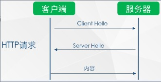
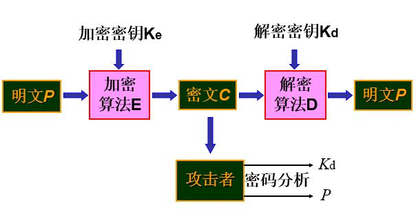
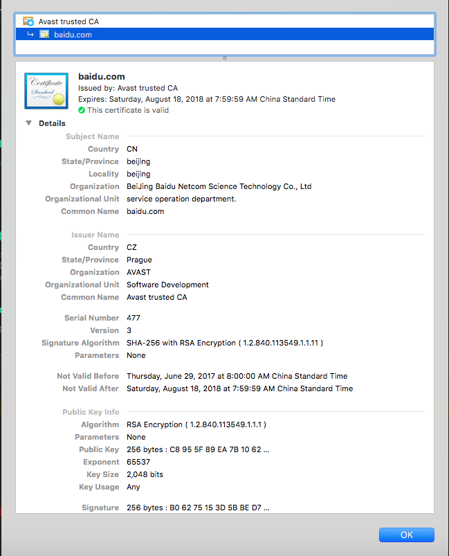

# HTTPS 你准备好了吗

## HTTPS协议
HyperText Transfer Protocol over Secure Socket Layer 的简称。

阅读更多关于[HTTP/1.x vs HTTP/2](./http1-vs-http2.md)

安全！安全！安全！

### HTTP的安全隐患

标准HTTP通信

* 窃听风险(eavesdropping) - 第三方可以获知通信内容。窃取密码、个人信息
* 篡改风险(tampering) - 第三方可以修改通信内容。流量劫持、广告植入
* 冒充风险(pretending) - 第三方可以冒充他人身份参与通信。伪造身份

### HTTPS的风口

* Google调整搜索引擎算法，HTTPS的网站在搜索中排名更靠前
* 从2017年开始，Chrome浏览器已把采用HTTP协议的网站标记为不安全网站
* 苹果要求2017年App Store中的所有应用都必须使用HTTPS加密连接
* 微信小程序也要求必须使用HTTPS协议
* 新一代的HTTP/2协议的支持需以HTTPS为基础

## HTTPS到底干了什么

### SSL or TLS

SSL(Secure Socket Layer，安全套接字层)。1994年为 Netscape 所研发，SSL协议位于TCP/IP协议与各种应用层协议之间，为数据通讯提供安全支持。

TLS(Transport Layer Security，传输层安全)。其前身是SSL，它最初的几个版本(SSL 1.0、SSL 2.0、SSL 3.0)由网景公司开发，1999年从3.1开始被IETF标准化并改名，发展至今已经有TLS 1.0、TLS 1.1、TLS 1.2三个版本。SSL3.0和TLS1.0由于存在安全漏洞，已经很少被使用到。TLS 1.3改动会比较大，目前还在草案阶段，目前使用最广泛的是TLS 1.1、TLS 1.2。

扩展阅读[TLS 1.3概述](http://www.inforsec.org/wp/?p=1960)

### 加密

扩展阅读[信息安全技术及应用 常规加密技术](https://blog.csdn.net/codeforcer/article/details/51726109)

### 对称加密 

加密(encryption)与解密(decryption)使用的是同样的密钥(secret key)

* 优点：算法公开、计算量小、加密速度快、加密效率高。
* 缺点：秘钥的管理和分发非常困难，不够安全。

### 非对称加密

加密和解密使用不同的密钥，加密使用公开密钥（简称公钥），解密时使用私有密钥（简称私钥）。

* 优点：安全性更高，公钥是公开的，秘钥是自己保存的，不需要将私钥给别人。
* 缺点：加密和解密花费时间长、速度慢，只适合对少量数据进行加密。

[https://tools.ietf.org/html/rfc2616](https://tools.ietf.org/html/rfc2616)

### HTTPS通信机制

### SSL证书

SSL证书是数字证书的一种，类似于驾驶证、护照和营业执照的电子副本。因为配置在服务器上，也称为SSL服务器证书。
SSL证书就是遵守SSL协议，由受信任的数字证书颁发机构CA(Certificate Authority)，在验证服务器身份后颁发，具有服务器身份验证和数据传输加密功能。

### 客户端证书验证

1. 首先浏览器读取证书中的证书所有者、有效期等信息进行一一校验
2. 浏览器开始查找操作系统中已内置的受信任的证书发布机构CA，与服务器发来的证书中的颁发者CA比对，用于校验证书是否为合法机构颁发
3. 如果找不到，浏览器就会报错，说明服务器发来的证书是不可信任的。
4. 如果找到，那么浏览器就会从操作系统中取出颁发者CA的公钥，然后对服务器发来的证书里面的签名进行解密
5. 浏览器使用相同的hash算法计算出服务器发来的证书的hash值，将这个计算的hash值与证书中签名做对比
6. 对比结果一致，则证明服务器发来的证书合法，没有被冒充
7. 此时浏览器就可以读取证书中的公钥，用于后续加密了

### 获取SSL证书

* 自签名证书
  * 使用工具生成或者[在线生成](https://www.chinassl.net/ssltools/free-ssl.html)。实际应用具有局限性，不会被浏览器信任，一般用于测试环境或某些内部环境(路由器)。
* 免费证书
  * [Let's Encrypt](https://letsencrypt.org) 3个月有效期，到期可以自动续期
  * [腾讯云DV SSL](https://buy.cloud.tencent.com/ssl?fromSource=ssl) 1年有效期，赛门铁克亚太白金战略合作伙伴亚洲诚信（TrustAsia）自研证书品牌，由赛门铁克根证书签发
* 购买证书
  * 根据证书类型价格不等，可以自行选择

### SSL证书类型

* 按审核方式分类 
  * 域名验证DV SSL证书 
  * 企业验证OV SSL证书 
  * 企业增强/扩展验证EV SSL证书 

* 按照功能分类
  * 多域名 UCC/SAN SSL证书 
  * 强加密SGC SSL证书 
  * 通配符Wildcard SSL证书 
  * 代码签名Code Signing SSL证书

* 按照品牌（主要可信CA机构）
  * RapidSSL证书
  * GeoTrust SSL证书
  * COMODO SSL证书
  * VerSign SSL证书
  * Symantec SSL证书
  * Thawte SSL证书
  * Trustwave SSL证书 
  * GlobalSign SSL证书 
  * AlphaSSL SSL证书