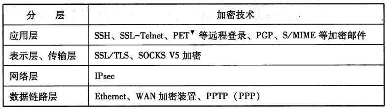

# 白话网络

## 引子

江湖小虾A偶然间获得了失传已久葵花宝典。正所谓有福同享，A想与远方的挚友B一同学习，共同进步，那么如何将这本秘籍（副本）送给B呢？


我等。。。我等。。。我等等等。。。。。。


### 快递邮寄

送书的方法不止一种，此处我们采用了快递的方式。


首先需要填写一份快递单

* 寄件人姓名、电话、地址
* 收件人姓名、电话、地址
* 数量、重量等

然后用袋子或者盒子把这本武林秘籍包装好

最后在外面贴上快递单，支付邮费，等待寄出

## 网络层次结构


### 应用层（邮寄物品）

以 http 协议为例，请求资源

```bash
curl http://www.baidu.com -v
```

#### hosts

计算机之间通信是基于ip地址的，但是ip地址对于大脑来说，是一串枯燥的数字非常不适合记忆。在TCP/IP设计之初就有了一个hosts的设计，hosts文件中记录了主机名和ip地址的映射关系，通过hosts可以直接使用主机名进行ip通信，避免了ip地址记忆的麻烦。

直到现在，它依然存在于计算机系统中，并且工作良好。

* mac、linux

> /etc/hosts

* windows

> C:\Windows\System32\drivers\etc

#### DNS

随着网络规模的扩大，每台主机都要维护一份数量庞大的hosts文件变得不现实，于是DNS就诞生了。

> 域名系统（英语：Domain Name System，缩写：DNS）是互联网的一项服务。它作为将域名和IP地址相互映射的一个分布式数据库，能够使人更方便地访问互联网。DNS使用TCP和UDP端口53。当前，对于每一级域名长度的限制是63个字符，域名总长度则不能超过253个字符。

> 全球13组IPv4根域名服务器以英文字母A到M依序命名，域名格式为“字母.root-servers.net”。全部已以任播技术在全球多个地点设立镜像站。

> 在与现有IPv4根服务器体系架构充分兼容基础上，“雪人计划”于2016年在美国、日本、印度、俄罗斯、德国、法国等全球16个国家完成25台IPv6根服务器架设，事实上形成了13台原有根加25台IPv6根的新格局，为建立多边、民主、透明的国际互联网治理体系打下坚实基础。中国部署了其中的4台，由1台主根服务器和3台辅根服务器组成，打破了中国过去没有根服务器的困境。

目前有超过1000台的IPv4根服务器在服务。

#### DNS工具 -- dig

```bash
dig www.baidu.com
```

没有的话可以先安装

```bash
brew install bind
```

指定dns服务器，污染？

```bash
dig www.google.com @1.1.1.1
```

### 传输层（打包）

重点关注最常用的两种协议：TCP 和 UDP

* UDP 数据报文

    

* TCP 数据报文

    

### 网络层（包裹运输）

* 明星：IP 协议

IP协议的主要工作是将数据包发送给最终的目标主机。而包裹运输的目的也是将包裹输送给指定的人。


一般情况下，两台通信的主机并不是通过一条网线直接连接，而是中间经过很多的网络设备。IP数据包要在复杂网络环境下进行传递，必须借助于路由表。


macOS 查看本机路由表

```bash
netstat -nr
```

修改路由表，以禁止访问百度为例

先通过host查询获得ip地址：

```bash
host www.baidu.com
```

给这些ip指定路由

```bash
sudo route add 104.193.88.77 0.0.0.0
sudo route add 104.193.88.123 0.0.0.0
```

修改路由表后，再次请求资源

```bash
curl http://www.baidu.com -v
```

追踪路由

```bash
traceroute -m 3 www.baidu.com
```

正常路由

```bash
traceroute ip.cn
```

删除路由

```bash
sudo route delete 104.193.88.77
sudo route delete 104.193.88.123
```

### 网络接口层

双绞线、光纤、无线等等

## 数据（包裹）的安全性


江湖人士争相夺取的武林秘籍，万一被快递小哥发现，偷偷抄录学习，如何得了？

如何确保运输的过程中不被窃取、串改？


高人甲：可以用摩斯密码（对称加密）把葵花宝典先翻译下，等对方收到后再把内容还原。

高人已：不妥不妥，江湖中懂此摩斯密码者不计其数，很容易被猜到。

高人丙：这可如何是好。。。

高人丁：先与对方协商一种暗语（对称加密），只有你二人知晓，用暗语进行翻译，这样其他人即便截获秘籍，却也无法破译。

高人甲：好是好，但是如何将暗语安全的传递给对方呢？

高人丁：这好办，江湖上有位德高望重的大侠，人称CA，有了他的帮助你们可以放心的沟通（非对称加密）。

曰：如是甚好！

### 安全通信（运输）

小虾A利用非对称加密算法生成了一对密钥：私钥和公钥。

A拿着公钥找到了CA，说明了来意，CA嘴角微微一扬：来，先填个表格吧（A的信息及公钥），填好了我给你签个名（CA的私钥）。

不一会A就拿到了CA给的证书，看着崭新的证书，A激动不已。

稍作停留之后，A马上委托飞毛腿（江湖第一快）将公钥和证书一并送给B。

B拿到之后，电话咨询了CA，询问证书的事情，CA给了B一个口诀（CA的公钥），说用这口诀去解密下证书上的签名，内容如果和证书上写的内容一致，说明这个证书是正品，是属于A的，对方是小虾A，可以放心交流。

经过确认，B这下放心了，于是B想到了一个暗语，然后用A的公钥将暗语加密后委托飞毛腿送给A。

A收到B的回复，赶紧用私钥解密，获得了暗语（接下来使用的对称加密密钥），A马不停蹄的用暗语将葵花宝典加密完成，放心的快递发出。

### 信息加密

网络协议在制定初期，网络环境相对封闭，所以安全性并没有进行过多的过滤。但是现代网络结构日益复杂，网络安全问题凸显。



### 防火墙

一般在内外网络连接处，会设置防火墙，保护内部网络资源不被非法访问。


## 插播广告

#### [caddy](https://caddyserver.com/)

一个开源的，使用 Golang 编写，支持 HTTP/2 HTTP/3 的 Web 服务器，最著名的特性是默认启用 HTTPS。与 nginx 相比，近乎零配置即可提供 web 服务。

```bash
/opt/caddy/caddy run --config /opt/caddy/Caddyfile
```

```Caddyfile
test.com {
  tls internal
  reverse_proxy /api/* http://127.0.0.1:9001
  reverse_proxy http://127.0.0.1:3000
}

```

*扩展阅读*

* [只有 13 台 DNS 根域名服务器原因](https://jaminzhang.github.io/dns/The-Reason-of-There-Is-Only-13-DNS-Root-Servers/)
* [美国如果把根域名服务器封了，中国会从网络上消失？](https://segmentfault.com/a/1190000023696737)
* [白话解释 对称加密算法 VS 非对称加密算法](https://segmentfault.com/a/1190000004461428)
* [一些电子书（学习使用）](https://github.com/dolotech/ebook)
