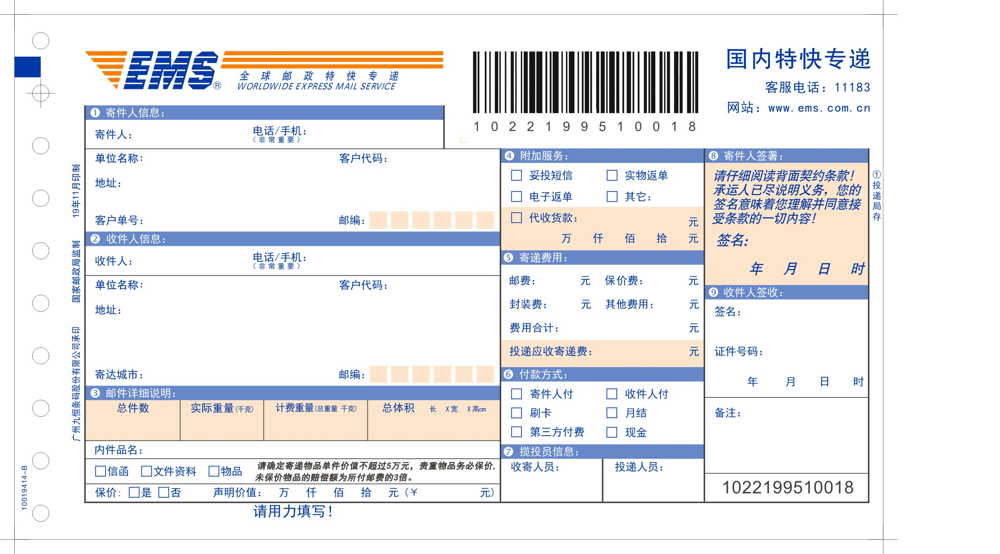
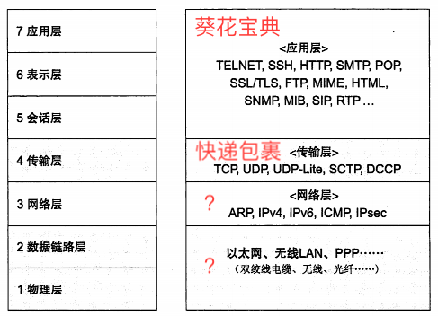
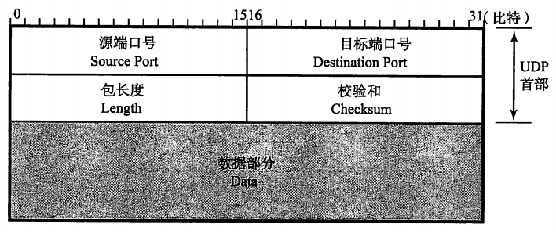
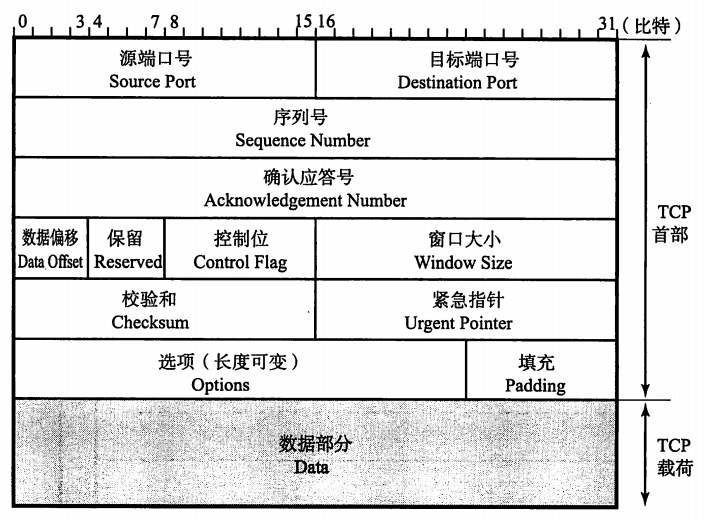
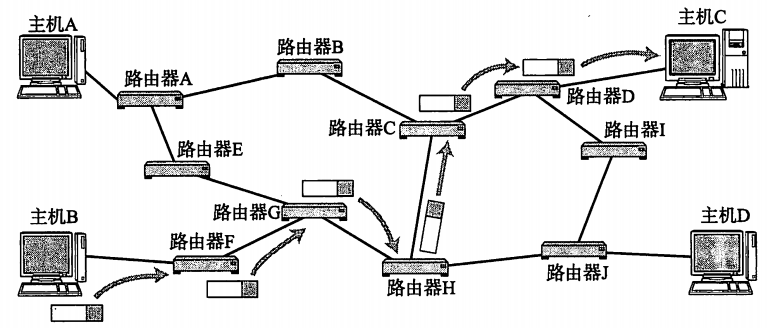
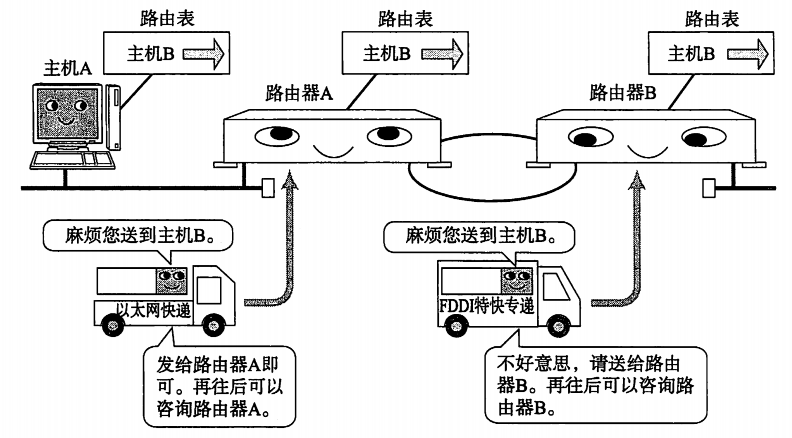

# 白话网络

## 引子

如何将葵花宝典送给远方的挚友？


我等。。。我等。。。我等等等。。。。。。


## 快递邮寄

送书的方法不止一种，此处我们采用了快递的方式。



首先需要填写一份快递单

* 寄件人姓名、电话、地址
* 收件人姓名、电话、地址
* 数量、重量等

然后用袋子或者盒子把这本武林秘籍包装好

最后在外面贴上快递单，支付邮费，等待寄出

## 网络层次结构



### 应用层（邮寄物品）

以 http 协议为例，请求资源

```bash
curl http://www.baidu.com -v
```

### 传输层（打包）

重点关注最常用的两种协议：TCP 和 UDP

* UDP 数据报文
    

* TCP 数据报文
    

### 网络层（包裹运输）

* 明星：IP 协议

IP协议的主要工作是将数据包发送给最终的目标主机。而包裹运输的目的也是将包裹输送给指定的人。



一般情况下，两台通信的主机并不是通过一条网线直接连接，而是中间经过很多的网络设备。IP数据包要在复杂网络环境下进行传递，必须借助于路由表。



macOS 查看本机路由表

```bash
netstat -nr
```


## 广告时间

#### [caddy](https://caddyserver.com/)

一个开源的，使用 Golang 编写，支持 HTTP/2 HTTP/3 的 Web 服务器，最著名的特性是默认启用 HTTPS。与 nginx 相比，近乎零配置即可提供 web 服务。

```bash
/opt/caddy/caddy run --config /opt/caddy/Caddyfile
```

```Caddyfile
test.com {
  tls internal
  reverse_proxy /api/* http://127.0.0.1:9001
  reverse_proxy http://127.0.0.1:3000
}

```

*扩展阅读*

* [一些电子书（学习使用）](https://github.com/dolotech/ebook)
* [ES6走走看看—字符到底发生了什么变化](https://juejin.im/post/5b913a856fb9a05d212e75bf)

