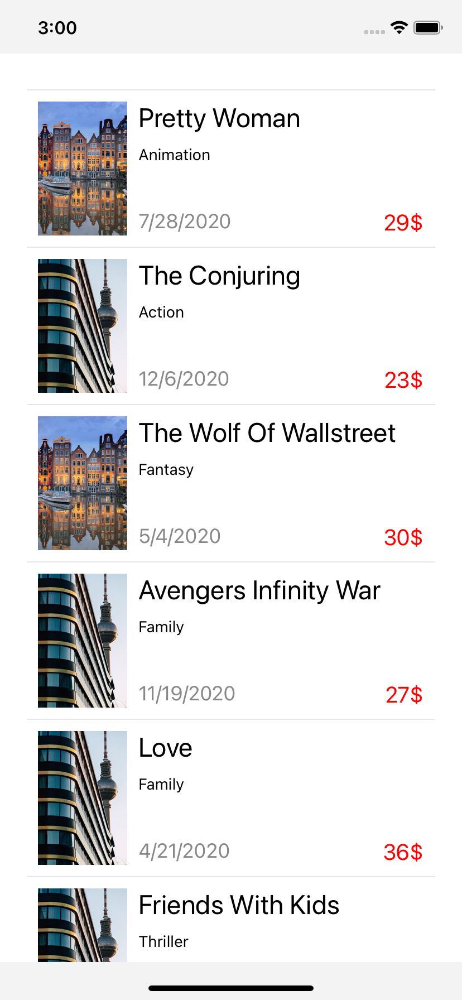

# React Native

[React Native之原理浅析](http://blog.poetries.top/2019/10/02/rn-yuanli/)

[深入理解JSCore](https://tech.meituan.com/2018/08/23/deep-understanding-of-jscore.html)

[跨平台布局引擎Yoga的学习和使用](https://juejin.cn/post/6844903591233191943)

[React Native渲染原理浅析](https://cloud.tencent.com/developer/article/1651096)

# 任务目标

实现列表页面数据展示：

基础功能：
 * 应用内嵌数据（10条）
 * 仅展示文字内容，简单排版（不要太丑）

进阶功能：
 * 应用内嵌数据（100条）
 * 展示文字和图片内容，排版美观

高阶功能：
 * 通过网络获取数据（100条）
 * 展示文字和图片内容，排版美观
 * 列表性能优化

# 数据源

10条记录

> https://raw.githubusercontent.com/felix-fly/know-how/master/test-data/movie10.json

100条记录

> https://raw.githubusercontent.com/felix-fly/know-how/master/test-data/movie100.json

也可以自行建立数据，给出一个在线生成测试数据的工具：

https://www.onlinedatagenerator.com/

